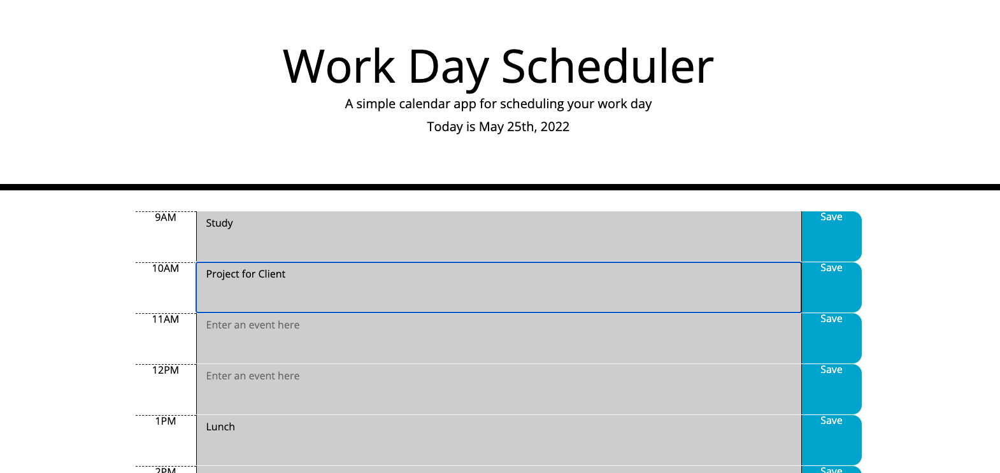

# Work-Day-Scheduler

This app is a simple scheduler for workday hours. It will allow a user to save text that represents a task or event for a given hour of the day. It is stored to local memory, so when the user returns to the webpage, it will remember and display the task that they have entered.

## Link to Published Webpage

https://jcdoran33.github.io/Work-Day-Scheduler/

## Screenshot Image of Published Webpage

